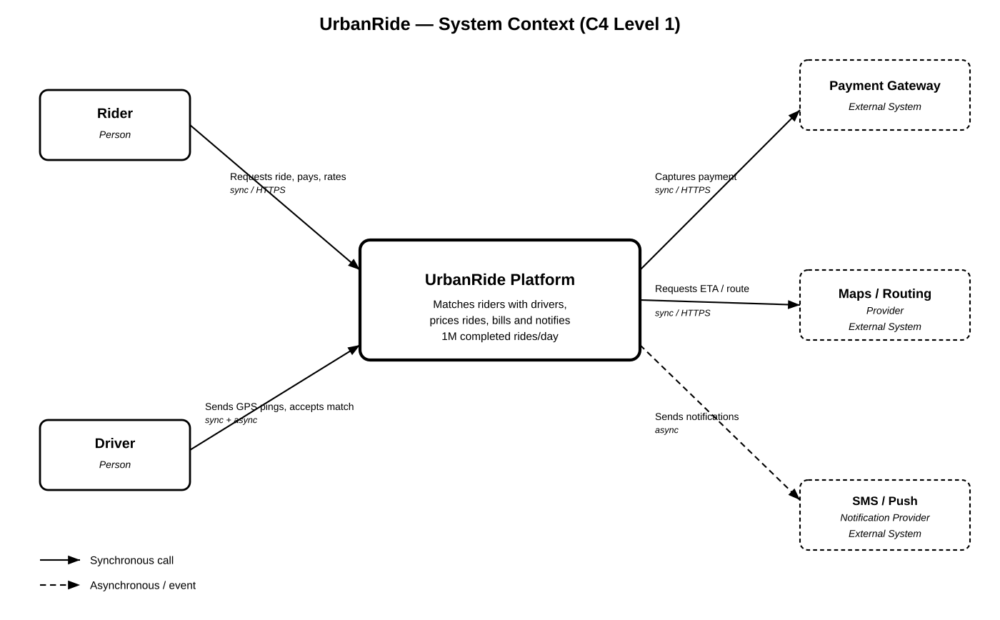
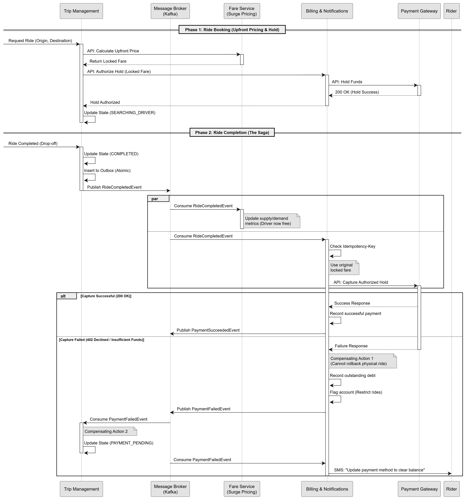
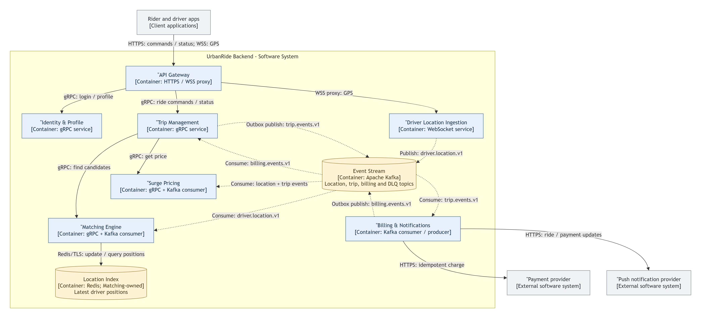
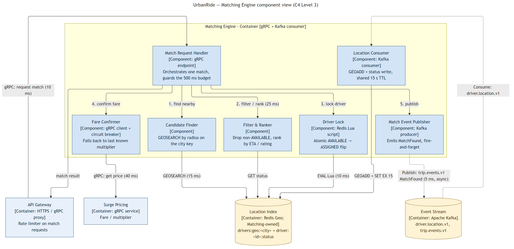
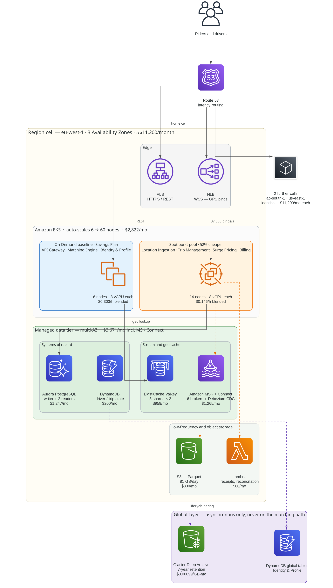

# UrbanRide — Architecture Design Document

**Document control**

| Field | Value |
|---|---|
| System | UrbanRide ride-hailing backend |
| Document | Architecture Design Document (ADD) |
| Version | 1.0 |
| Date | 13 September 2026 |

**Contents**

- [0. Overview and shared assumptions](#0-overview-and-shared-assumptions)
- [1. Context and Decomposition](#1-context-and-decomposition)
- [2. Data Design and Transactions](#2-data-design-and-transactions)
- [3. Communication and Streaming](#3-communication-and-streaming)
- [4. Geospatial Matching and Latency](#4-geospatial-matching-and-latency)
- [5. Infrastructure and Cost](#5-infrastructure-and-cost)
- [6. Summary and requirements check](#6-summary-and-requirements-check)
- [Appendix A — Key architecture decisions](#appendix-a--key-architecture-decisions)
- [References](#references)

---

## 0. Overview and shared assumptions

UrbanRide is a ride-hailing backend that must complete **1,000,000 rides per day**, keep the ride-request transaction **under 500 ms**, absorb a **5× surge**, and cost **less than 10 LKR per completed ride**. This document presents the architecture in five sections, one per concern, each with one diagram (C4 Levels 1–3, a Saga sequence diagram, and a deployment topology).

### 0.1 Scale assumptions

| Quantity | Value |
|---|---|
| Completed rides/day | 1,000,000 |
| Average ride request rate | ~12 req/s |
| Peak ride request rate (5× surge) | ~60 req/s |
| Active drivers at peak | 150,000 |
| GPS ping interval | 4 seconds |
| Driver location ingestion rate | ~37,500 pings/s |
| Latency budget (ride request → driver assigned) | 500 ms |
| Cost ceiling | 10 LKR/ride ≈ 10M LKR/day (~$33k/day at 300 LKR/USD) |

These figures are **platform-wide totals**. Section 5 sizes each regional cell's baseline to its own share and its *ceiling* to the full platform peak, so any one cell can absorb the whole load and the cost model is a deliberate upper bound.

### 0.2 Services

| Core services | Supporting services |
|---|---|
| Trip Management | API Gateway |
| Driver Location Ingestion | Identity & Profile |
| Matching Engine | |
| Surge Pricing | |
| Billing & Notifications | |

### 0.3 The ride-request flow in one paragraph

The rider requests a ride; **Trip Management** obtains a locked upfront fare from **Surge Pricing**, asks **Billing & Notifications** to place an authorisation hold on the rider's card, and only then records the trip as `SEARCHING_DRIVER`. Trip Management then calls the **Matching Engine**, which searches its Redis geo-index (kept fresh by the **Driver Location Ingestion** stream through Kafka), atomically locks a driver, and returns the assignment. Trip Management persists `MATCHED` and publishes `DriverAssigned` through its transactional outbox; drivers and riders are notified. On drop-off, ride completion runs as a choreographed Saga over Kafka: Billing captures the hold and either `PaymentSucceeded` or `PaymentFailed` drives the compensating actions. Every section below elaborates one part of this flow.

**The 500 ms budget** covers the ride-request transaction: from Trip Management recording `SEARCHING_DRIVER` to the rider's app receiving the assigned driver. The upfront quote and card authorisation happen before it, in a separate, user-visible "confirming your ride" step whose duration is governed by the payment provider's SLA rather than by UrbanRide.

### 0.4 Diagram conventions

All five diagrams use the same conventions: **solid arrows are synchronous calls**, **dashed arrows are asynchronous event flow**. Figures 1, 3 and 4 follow the C4 model (Levels 1–3); Figure 2 is a sequence diagram; Figure 5 is a deployment topology.

---

## 1. Context and Decomposition

### 1.1 System context (C4 Level 1)

UrbanRide is one system from the outside, with two human actors and three external dependencies.

| External party | Relationship to UrbanRide |
|---|---|
| Rider (mobile app) | Requests rides, pays, rates trips |
| Driver (mobile app) | Sends GPS pings, receives assignments, can decline, updates trip status |
| Payment Gateway | Card/wallet authorisation holds and captures |
| Maps / Routing Provider | ETA and route calculation (called by Trip Management at quote time) |
| SMS / Push Notification Provider | Trip and OTP delivery |



*Figure 1. System context. Internal services do not appear at Level 1; decomposition begins at Level 2 (Figure 3).*

### 1.2 Boundary principle

Boundaries are drawn where **workload characteristics diverge or consistency requirements diverge** — not by technical layering and not "one microservice per noun in the brief". A capability gets its own service when it must scale independently, fail independently, or hold a different CAP stance than its neighbours. Otherwise it stays merged (Section 1.4).

The dominant driver is the **625× gap** between location ingestion (~37,500 events/s) and ride requests (~60/s at peak).

### 1.3 Bounded contexts and data ownership

No service reads or writes another service's datastore; cross-service access happens only by API call or event.

| # | Service | Bounded context / responsibility | Owns (datastore, see Section 2.1) | Why it is separate |
|---|---|---|---|---|
| 1 | API Gateway | Request routing, auth-token validation, edge rate limiting | Rate-limit counters and routing config (Redis); no business data | Only internet-facing component; different scaling and security posture from every internal service |
| 2 | Identity & Profile | User/driver identity, credentials, KYC/verification state | User and driver profiles, credentials, KYC state (DynamoDB global tables) | Auth data has a lifecycle and consistency need distinct from operational trip data |
| 3 | Trip Management | Trip lifecycle state machine: `REQUESTED → SEARCHING_DRIVER → MATCHED → IN_PROGRESS → COMPLETED / CANCELLED / PAYMENT_PENDING`; booking orchestration | Trip records, trip state machine, audit log, outbox (Aurora PostgreSQL) | Single source of truth for trip state; the only service permitted to declare a trip's status |
| 4 | Driver Location Ingestion | Accept, validate and publish driver GPS pings at ~37,500/s | The raw GPS stream (Kafka `driver.location.v1`) and its archive (S3) | Highest-throughput path; must scale independently of every transactional service |
| 5 | Matching Engine | Candidate search, ranking and atomic driver reservation | The live Redis geo-index and driver status/lock keys, written by its own Location Consumer; otherwise stateless | The core low-latency algorithm; independently tunable; holds the short-lived reservation lock |
| 6 | Surge Pricing | Zone-level supply/demand aggregation, active multiplier, upfront fare quote | Zone signals and multipliers (DynamoDB) | A streaming-analytics workload with its own update cadence |
| 7 | Billing & Notifications | Card authorisation holds, fare capture, debt ledger, trip/OTP notifications | Fare ledger, payment status, notification log, outbox (Aurora PostgreSQL, separate logical database) | Financial-correctness requirements are incompatible with the availability posture of the dispatch path |

Examples of the ownership rule: the Matching Engine *reads* the location stream but Driver Location Ingestion *owns* it; Trip Management *requests* a match but the Matching Engine *owns* the decision; Billing *consumes* trip-completion events but Trip Management *owns* trip state.

### 1.4 What was deliberately not split — and why

| Considered split | Why rejected |
|---|---|
| Separate Billing vs. Notifications services | Both are low-volume and trigger off the same trip-completion event; splitting adds a hop for no scaling benefit |
| Standalone Fare Calculation service | A pure function of trip data and surge multiplier, with no independent scaling profile; would add a fourth network call to the booking Saga |
| Per-lifecycle-stage trip services | Stages of one state machine need a single authoritative owner |
| Merge Surge Pricing into Matching Engine | Different data shape (aggregated, slow-updating) and different scaling driver (zone count, not request rate) |
| Per-city / per-region service instances | Regional variation is a deployment and data-partitioning concern (Section 5.1), not a domain boundary |
| Separate API Gateway per client type | Duplicates auth and rate-limiting logic without reducing coupling |

### 1.5 Why not a monolith?

A monolith combining ride transactions, GPS ingestion, matching, pricing, billing and notifications would let the ~37,500 pings/s location workload force the entire application to scale together — directly threatening the 10 LKR/ride ceiling — and would let a slowdown in one capability cascade into unrelated ones (a matching spike delaying completed-trip billing). The seven-service decomposition gives independent scaling, fault isolation, clear data ownership and independent evolution, without fragmenting further than Section 1.2 justifies.

### 1.6 CAP stance per service

| Service | Stance | Why |
|---|---|---|
| Driver Location Ingestion | **AP** | A consensus write per ping at 37,500/s would blow the latency budget; staleness of a few seconds is corrected by the next ping |
| Matching Engine | **AP** (index) with an atomic reservation | Candidate search tolerates seconds-old positions. Double-booking is prevented by an atomic Redis Lua reservation (Section 4.5), but the authoritative "this driver is on this trip" record is Trip Management's, not Redis's |
| Surge Pricing | **AP** | A cached, periodically refreshed multiplier; staleness is cheaper than blocking the request path |
| Trip Management | **CP** | The trip state machine must not fork; reduced availability beats corrupted trip state |
| Billing & Notifications | **CP** (billing) / AP (notifications) | Money cannot be eventually consistent; a delayed push notification has no financial consequence |
| Identity & Profile | **CP** within its home cell | A revoked driver must not keep matching; strongly consistent reads in the home region. Cross-region replication of reference data is eventually consistent (Section 5.1) and never on the matching path |

The two stances the panel will probe hardest are Driver Location Ingestion → AP and Billing → CP.

### 1.7 Cost traceability

1,000,000 rides/day × 10 LKR = 10,000,000 LKR/day, matching the brief. The decomposition supports this by letting each service scale to its own workload (Section 5.2) instead of provisioning everything for the highest-volume component.

---

## 2. Data Design and Transactions

### 2.1 Database-per-service

Datastores are strictly isolated per service. This prevents noisy neighbours (heavy GPS writes never touch billing reads) and lets each store be tuned for its own cost and latency profile.

| Service | Datastore | Rationale | CAP |
|---|---|---|---|
| **API Gateway** | Redis (rate-limit counters) | Ephemeral counters only; no business data | — |
| **Identity & Profile** | DynamoDB global tables | Read-mostly key lookups; strongly consistent reads in the home cell; reference data replicated to other cells eventually | CP (home cell) |
| **Trip Management** | Aurora PostgreSQL, provisioned (1 writer + 2 readers) [R25] | Strong ACID guarantees for the trip state machine and outbox. Aurora Serverless v2 was considered, but at a steady 12–60 transactions/s the writer is far below capacity; a provisioned cluster under a Savings Plan is cheaper, and the 5× surge is absorbed by the Trip Management pods and the readers (Sections 5.2 and 5.5) | CP |
| **Driver Location Ingestion** | Kafka `driver.location.v1` (buffer, 1 h) + S3 (archive) | Writing 37,500 pings/s straight into a database is too expensive. Phones stream to Kafka; consumers read from there. Raw history is batched into Parquet and archived to S3 (Section 5.4) | AP |
| **Matching Engine** | Redis geo-index + status/lock keys (Matching-owned, Section 4.1) | Ephemeral, in-memory, rebuilt from the live stream in ~4 s; nothing needs backup | AP |
| **Surge Pricing** | DynamoDB (on-demand) | Fast reads/writes of zone multipliers; pay per request during bursts | AP |
| **Billing & Notifications** | Aurora PostgreSQL — separate logical database on the same cell cluster, own schema and credentials | Financial data must be strongly consistent (no double charges). Outbox pattern decouples the payment transaction from slower SMS/push delivery | CP |

Trip Management and Billing share one Aurora cluster per cell for cost (Section 5.5) but are separate databases with no cross-database access; database-per-service is enforced at the logical level.

### 2.2 Distributed transactions: a hybrid Saga



*Figure 2. Phase 1 (ride booking) is orchestrated synchronously by Trip Management; Phase 2 (ride completion) is choreographed over Kafka.*

Two-phase commit across services is not an option, so a **hybrid Saga** is used:

- **Phase 1 — Ride booking: orchestration.** Trip Management synchronously calls Surge Pricing (*calculate upfront price → locked fare*) and Billing (*authorise hold on the locked fare → payment gateway*). A rider whose card cannot hold the fare is rejected immediately. Only after the hold succeeds does Trip Management record `SEARCHING_DRIVER` and call the Matching Engine (Section 4). If the Matching Engine finds no driver within the retry window, the compensating action is to **void the hold** and set the trip to `CANCELLED`.
- **Phase 2 — Ride completion: choreography.** Fully event-driven via Kafka, because completion must stay highly available and decoupled during drop-off surges.

**Successful completion**

1. Trip Management marks the ride `COMPLETED` and, in the same transaction, writes `RideCompleted` to its outbox → `trip.events.v1`.
2. In parallel: **Surge Pricing** consumes the event to update supply (the driver is free again); **Billing** consumes it, uses the *locked fare from booking*, and asks the payment gateway to **capture** the authorised hold → writes `PaymentSucceeded` to its outbox → `billing.events.v1`.

**Failure and compensating actions** — the card declines *after* the physical ride, which cannot be rolled back:

1. Billing receives the decline and publishes `PaymentFailed`.
2. *Compensation (Billing):* record a debt on the rider's account and block new ride requests.
3. *Compensation (Trip Management):* consume `PaymentFailed` and move the trip to `PAYMENT_PENDING`.
4. *Notifications:* SMS the rider to update their payment method.

### 2.3 Idempotency

Double-charging a rider is the worst-case outcome, so idempotency is enforced on every API endpoint and every event consumer:

- Every request and event carries a unique `Idempotency-Key` (UUID); events additionally carry a unique `eventId`.
- The receiving service checks an `idempotency_keys` table (or Redis set) inside the same transaction as its business change.
- A repeated key returns the cached result instead of re-running the logic. Payment retries reuse the same provider-side idempotency key, so a Kafka redelivery can never charge twice.

### 2.4 Transactional outbox

A service that updates its database and then publishes to Kafka can crash in between and lose the event (the dual-write problem). The **outbox pattern** removes it:

1. When Trip Management (or Billing) changes state, it inserts the event payload into a local `outbox` table **in the same database transaction**.
2. A change-data-capture connector (**Debezium**) tails the database write-ahead log — no polling queries, no lock contention — and publishes each outbox row to Kafka.
3. The connector advances only after Kafka acknowledges the write (`acks=all`, Section 3.3); on failure it retries. Delivery is therefore **at-least-once** and never lost, and consumers deduplicate with `eventId` (Section 2.3).

### 2.5 Lock contention on driver assignment (double booking)

During a 5× surge, several riders in one area can be matched against the same driver at the same instant. Pessimistic database locks would destroy the 500 ms budget, so the reservation is an **optimistic, atomic check-and-set in Redis**:

- The Matching Engine runs a short Lua script that checks `status == AVAILABLE` and flips it to `ASSIGNED:<tripId>` in one atomic step (Section 4.5).
- If the script returns `0` — another request won a millisecond earlier — the engine moves to the next ranked candidate. No waiting, no deadlocks.
- The Redis reservation is short-lived (15 s TTL). The durable assignment is written by Trip Management to Aurora (`MATCHED`) and published as `DriverAssigned` through the outbox; Redis never holds the record of truth.

---

## 3. Communication and Streaming

UrbanRide separates immediate ride requests from continuous GPS traffic and background billing. The request path reads the latest available location index; it never waits on Kafka consumers or payment processing. This is what keeps the ride-request transaction under 500 ms while absorbing bursts of 37,500 GPS events/s.



*Figure 3. Communication-focused container view. Solid arrows are direct calls; dashed arrows are Kafka event flow. Service-owned databases are omitted (see Section 2.1); the synchronous Trip Management → Billing call for the authorisation hold is shown in Figure 2.*

### 3.1 Protocol choices

| Link | Protocol | Reason |
|---|---|---|
| Rider / driver apps → API Gateway | HTTPS/REST | Simple commands and status queries; ride creation carries an idempotency key for safe retries |
| Driver app → Driver Location Ingestion (through the Gateway's WSS proxy) | Secure WebSocket (WSS) | One persistent connection per driver carries a ping every 4 s with negligible connection overhead |
| API Gateway → Trip Management, Identity & Profile | gRPC over TLS | Typed, compact requests with reused connections and propagated deadlines |
| Trip Management → Surge Pricing (quote), Billing & Notifications (hold), Matching Engine (find driver) | gRPC over TLS | Synchronous steps of the booking orchestration (Section 2.2) |
| Trip Management → Maps / Routing Provider | HTTPS/REST | ETA and route at quote time; cached per origin–destination cell |
| Services ↔ Kafka | Kafka protocol over TLS | Independent consumers, buffering and replay decouple GPS, pricing and billing |
| Billing & Notifications → payment / SMS / push providers | HTTPS/REST | Provider integration runs outside the request path |

The Gateway validates access tokens locally with cached signing keys, so GPS pings never trigger identity calls. Every gRPC call carries a **bounded deadline** derived from the remaining latency budget; retries are attempted only for safe operations within that budget [R1].

### 3.2 Kafka topics and consumer groups

| Topic | Partition key / retention | Producer → consumer groups |
|---|---|---|
| `driver.location.v1` | `driverId` / 1 hour | Driver Location Ingestion → `matching-location`, `surge-location` |
| `trip.events.v1` (`DriverAssigned`, `RideCompleted`, `TripCancelled`) | `tripId` / 7 days | Trip Management (outbox) → `surge-demand`, `billing-notifications` |
| `billing.events.v1` (`PaymentSucceeded`, `PaymentFailed`) | `tripId` / 7 days | Billing & Notifications (outbox) → `trip-billing` |
| `match.events.v1` (`MatchFound`) | `tripId` / 7 days | Matching Engine → `surge-supply` |

`driver.location.v1` starts with **48 partitions**, ≈781 events/s per partition at the assumed load — an initial sizing choice, not a measured guarantee. Hashing `driverId` spreads a stadium's drivers across partitions while preserving each driver's order. Each consumer group receives the full stream; replicas within a group share partitions, so up to 48 consumers can be active. GPS retention is one hour because fresh positions matter more than history.

The Matching Engine's consumer (`matching-location`) updates its Redis location index (Section 4.2). Surge Pricing independently combines `driver.location.v1` (supply) with `trip.events.v1` (demand) to compute zone multipliers, so a pricing slowdown never touches the matching consumer.

`match.events.v1` is an **informational** stream: it lets Surge Pricing see supply drop the moment a driver is reserved. It is published fire-and-forget by the stateless Matching Engine and is *not* the authoritative assignment — that is `DriverAssigned`, written by Trip Management through its outbox after the match reply.

GPS events carry capture time and a per-driver monotonic sequence, so a replay can never overwrite a newer position. All events use versioned schemas and unique `eventId` values.

### 3.3 Delivery guarantees

Replication factor **3**, `min.insync.replicas = 2`, `acks=all`, idempotent producers [R2]. Consumers commit offsets only after successful processing, giving **at-least-once** processing; consumers deduplicate on `eventId` inside the same transaction as their business change (Section 2.3), and payment retries reuse the provider idempotency key. This prevents duplicate effects without claiming end-to-end exactly-once delivery [R3]. Trip and billing events originate only from the transactional outbox (Section 2.4); GPS consumers may discard superseded or expired positions. Owning databases retain authoritative records beyond Kafka's retention window.

### 3.4 Backpressure and failure handling

- **Protect request capacity.** Stream workers are isolated from request handlers. GPS connections get separate Gateway capacity and bounded ingestion buffers. Ingestion rate-limits per driver; under overload it keeps only the newest unsent position and asks the app to report more slowly. On reconnect a driver sends its current position, not a backlog.
- **Keep matching fresh.** Consumer lag is monitored in seconds and consumers scale within the partition limit (Section 5.3). A lag above **2 s** alerts; the Location Consumer **discards any ping older than 12 s** (three missed intervals) during replay so stale positions are never written as current, and index entries expire on their own at **15 s** (Section 4.1). A Kafka outage therefore shrinks the candidate set rather than exposing stale positions; unpublishable business events wait safely in the outbox.
- **Recover without retry storms.** Affected partitions are paused during dependency outages; retries use bounded exponential backoff with jitter. Malformed or repeatedly failing records are quarantined in consumer-specific `<topic>.<group>.dlq` topics (7-day retention) with an alert to the owner; the source offset is committed only after durable quarantine. Replay after correction reuses the original `eventId`, and dependent business transitions are held until the failed event is resolved.

---

## 4. Geospatial Matching and Latency

This is the part of UrbanRide that must be fastest: finding a nearby free driver for a rider. The fare is already locked and the card already authorised when the Matching Engine is called (Section 2.2), so matching has exactly two dependencies — Redis and Kafka — and no dependency on Surge Pricing or Billing.

### 4.1 Geo-index choice: Redis Geo vs H3 vs S2

The Matching Engine must serve ~60 lookups/s at peak against 150,000 drivers pinging every 4 s (~37,500 writes/s).

| Option | How it works | Verdict |
|---|---|---|
| **Redis Geo** | Sorted set keyed by geohash; `GEOSEARCH` returns members within a radius, in memory | **Chosen.** Sub-millisecond radius search, no second index to keep in sync, no extra moving parts |
| Uber H3 | Hexagonal cells; drivers looked up by cell id | Excellent for uneven density, but adds a second index to keep consistent with Redis; not needed at this scale |
| Google S2 | Hierarchical cells on a space-filling curve | Very precise, heavier to compute; suited to global-scale spatial joins we do not need |

**Layout** — one geo set per city so a lookup scans only that city's fleet, plus a status key per driver:

| Key | Type | Holds | TTL |
|---|---|---|---|
| `drivers:geo:<city>` | Geo set | Latest position of every active driver in the city | Members are removed lazily when their status key has expired |
| `driver:<id>:status` | String | `AVAILABLE`, `ASSIGNED:<tripId>` or `OFFLINE` | 15 s — the TTL is **extended** on every ping (`EXPIRE`); the value changes only on state transitions |

### 4.2 Handling 37,500 GPS writes per second

The index is write-heavy (37,500 writes/s vs ~60 reads/s), so writes must be cheap:

- Pings never hit the Matching Engine's request path. Driver Location Ingestion publishes to `driver.location.v1`; the Matching Engine's **Location Consumer** reads the topic and writes Redis. If Redis is briefly slow, pings queue in Kafka rather than being lost.
- The consumer writes in **pipelined batches**: one `GEOADD` plus one `EXPIRE` per ping ≈ 75,000 simple commands/s. A single Redis node handles well over 100,000/s, and the index is split across **3 shards by city** (Section 5.5), leaving headroom for the 5× surge.
- The data is small: 150,000 drivers × ~100 bytes ≈ **15 MB**.
- Because every driver pings every 4 s, the index **rebuilds itself in ~4 s** from the stream; no persistence or restore is needed.

### 4.3 Latency budget (must stay under 500 ms)

The budget covers the ride-request transaction from `SEARCHING_DRIVER` to the rider receiving the driver (Section 0.3).

| Step | Where | Budget |
|---|---|---|
| Rider app → API Gateway | Network + TLS | 30 ms |
| API Gateway → Trip Management | gRPC | 10 ms |
| Trip Management → Matching Engine | gRPC | 10 ms |
| Find nearby drivers | Redis `GEOSEARCH` | 15 ms |
| Filter and rank candidates | Matching Engine logic | 25 ms |
| Lock the chosen driver | Redis Lua script (Section 4.5) | 10 ms |
| Publish `MatchFound` | Kafka producer, async — does not block the reply | 5 ms |
| Persist `MATCHED` + outbox row | Trip Management → Aurora write | 20 ms |
| Response → rider app | Network | 30 ms |
| **Happy-path subtotal** | | **155 ms** |
| Safety margin (queueing, retries, surge slowdown) | | 345 ms |
| **Total** | | **500 ms** |

Keeping the happy path near 155 ms leaves more than twice that in margin for the 5× surge, when queues lengthen and downstream calls slow. Surge Pricing's 40 ms quote call and the payment hold sit *before* this budget (Section 2.2).

### 4.4 Cache invalidation on driver state change

- Every driver state change (`AVAILABLE`, `ASSIGNED`, `OFFLINE`) is written to Redis the moment it happens — there is no batch job and no stale window.
- Location and status share the same 15 s TTL. If a phone stops pinging (crash, tunnel, dead battery) the entry expires on its own and the driver drops out of matching instead of staying "available" forever.
- Pings only extend the TTL; they never overwrite the status value, so a ping cannot resurrect an `ASSIGNED` driver as `AVAILABLE`.
- The atomic lock (Section 4.5) closes the gap between "found" and "assigned".

### 4.5 Atomic driver lock (no double booking)

Two concurrent `GEOSEARCH` calls can return the same driver. The check-and-assign step runs as **one Redis Lua script**, which Redis executes without interleaving any other command:

```lua
-- KEYS[1] = driver:<id>:status   ARGV[1] = trip id
if redis.call('GET', KEYS[1]) == 'AVAILABLE' then
  redis.call('SET', KEYS[1], 'ASSIGNED:' .. ARGV[1], 'EX', 15)
  return 1   -- locked: this rider gets the driver
end
return 0     -- someone else got there first
```

- On `0` the Matching Engine simply tries the **next driver in its ranked list** — which is why filter-and-rank returns a short candidate list, not one driver.
- The lock carries the trip id, so a later release only clears the lock if it still belongs to that trip.
- The lock has the same 15 s TTL. If the Matching Engine crashes right after locking, the lock expires and the driver becomes available again. Trip Management confirms the assignment in Aurora (Section 2.5) and, while the trip is active, the status is refreshed as `ASSIGNED` by the driver's pings.
- **Driver decline:** assignment is automatic, but the driver app may decline within a short window. Trip Management then releases the lock and re-runs the match; this happens after the reply and is outside the 500 ms budget.

### 4.6 Protecting the matching path: rate limiters, circuit breakers, bulkheads

- **Rate limiter** on ride requests at the API Gateway. When the Matching Engine is at capacity, excess requests are briefly queued or answered with "high demand, please wait" rather than overloading Redis.
- **Circuit breaker** on Trip Management's call to Surge Pricing (the quote step). If Surge Pricing times out, the breaker trips and Trip Management quotes using the last known multiplier for the zone instead of blocking every booking on a slow dependency.
- **Bulkheads:** the Matching Engine talks only to Redis and Kafka. It never calls Surge Pricing, Billing or Notifications, so a slowdown in any of those cannot spread into the matching path.
- If Redis is unreachable the engine returns "no drivers found" immediately rather than hanging; riders retry, which is better than every request queuing and breaching the budget for everyone.

### 4.7 When Redis fails or the network splits

The location index is deliberately **AP**: a position a few seconds old is fine; a matching service that is down is not.

- **One Redis node dies:** each shard has a replica; failover takes a few seconds. During that gap matching returns "no drivers found" for that city and riders retry. Nothing is lost — pings keep arriving through Kafka and refill the new primary within ~4 s.
- **Split between the Matching Engine and Redis:** treated as Redis being down — fast failure, no hanging. The Location Consumer pauses and its offset does not move, so pings replay once the link is back.
- **Split between regions:** irrelevant. A rider in Colombo is only matched with drivers in Colombo; the index is never shared across cells (Section 5.1).
- **Stale driver after a split:** a driver who was `AVAILABLE` before the split but is now offline expires from the index within 15 s. The worst case is one failed lock attempt, which "try the next candidate" already handles.

The only thing that must be **CP** is the final "this driver is on this trip" record, which lives in Trip Management's database and is protected by the Saga (Section 2.2) — never in Redis.

### 4.8 Matching Engine components (C4 Level 3)



*Figure 4. The components inside the Matching Engine. Solid arrows are direct calls on the matching path, numbered 1–4 in the order the Match Request Handler runs them, with the budget for each step from Section 4.3. Dashed arrows are Kafka events and never block a match: the Location Consumer keeps the Redis index fresh from `driver.location.v1`, and the Match Event Publisher sends `MatchFound` to `match.events.v1` without waiting for a reply. The caller is Trip Management, which has already locked the fare; the rate limiter sits in front of it at the API Gateway.*

---

## 5. Infrastructure and Cost

UrbanRide runs on AWS as **three self-contained regional cells** (`ap-south-1`, `eu-west-1`, `us-east-1`), each holding a complete copy of the seven services with its own EKS cluster, Kafka cluster, Redis cluster and relational store. Stateless services run on EC2 Spot capacity above a smaller On-Demand floor; everything stateful uses managed services, because self-managing Kafka or Redis on interruptible capacity trades a modest saving for a large operational risk. Every cell's ceiling is sized to the full platform peak (150,000 drivers, 37,500 pings/s), so the model below is an upper bound. Costs are planning estimates from us-east-1 list prices checked in September 2026 [R4]–[R14]; they are not quotations.

Redis is deployed as **Amazon ElastiCache (Valkey engine, Redis-API compatible)** [R27]; the rest of this document calls it Redis.



*Figure 5. One region cell expanded; the other two are identical. Solid arrows are synchronous calls, dashed arrows asynchronous event flow. Each tier is annotated with its monthly cost, so the figure doubles as a visual breakdown of Section 5.5. Service-to-service call flow is in Figure 3; database design in Section 2; geo-index layout in Section 4.*

### 5.1 Region cells and blast radius

A cell owns its drivers and trips outright — a cell-based architecture [R15] in which Route 53 latency routing [R16] pins each rider and driver to a home cell.

- **Matching never crosses a cell boundary**, because a driver 8,000 km away is never a candidate. The partitioning is a property of the domain, not an imposed constraint.
- **Only two things are global**, and neither is on the matching path: Identity & Profile reference data replicated through DynamoDB global tables [R26], and the analytics and archive lake in S3 with cross-region replication.
- **Network-partition answer:** a cell severed from the others keeps matching, pricing and trip completion running on local state, losing only cross-region profile propagation, which is eventually consistent by design (Section 1.6). The failure domain is one region's riders, not the platform.
- **Each cell spans three Availability Zones**, so an AZ loss is absorbed inside the cell by the managed services' own failover.

### 5.2 Compute topology and instance sizing

AWS encodes a machine's shape in its name. In `c7g.2xlarge`: `c` is compute-optimised, `7` the generation, `g` an AWS Graviton (ARM) processor [R20], `2xlarge` the size — **8 vCPU / 16 GiB**. `m7g.2xlarge` is the general-purpose sibling with the same 8 vCPU but **32 GiB**, used where a service holds more state per in-flight request. Graviton is used throughout for roughly 20% better price/performance on these Go and JVM workloads, which recompile for ARM without effort.

| Service | Workload character | Node type | Purchase model | Baseline → peak pods (per cell) |
|---|---|---|---|---|
| API Gateway | Connection-heavy, stateless | c7g.2xlarge (8 vCPU / 16 GiB) | On-Demand floor + Spot burst | 4 → 16 |
| Driver Location Ingestion | Network- and CPU-bound, stateless | c7g.2xlarge (8 vCPU / 16 GiB) | Spot above floor | 6 → 24 |
| Matching Engine | Latency-critical, cache-bound | c7g.2xlarge (8 vCPU / 16 GiB) | 40% On-Demand floor | 8 → 24 |
| Trip Management | Transactional, stateless | m7g.2xlarge (8 vCPU / 32 GiB) | On-Demand floor + Spot | 4 → 18 |
| Surge Pricing | Windowed aggregation | m7g.2xlarge (8 vCPU / 32 GiB) | Spot | 3 → 12 |
| Billing & Notifications | Asynchronous, deferrable | m7g.2xlarge (8 vCPU / 32 GiB) | Spot | 2 → 10 |
| Identity & Profile | Read-mostly | c7g.2xlarge (8 vCPU / 16 GiB) | On-Demand | 2 → 6 |
| Receipts, reconciliation, reports | Low-frequency, bursty | Lambda | Serverless [R12] | — |

**Where the pod counts come from.** The ride-request rate is small — ~12 req/s average, ~60/s at the 5× peak (Section 0.1) — which one pod could absorb on its own. Almost the whole fleet is therefore sized by the **GPS stream, not by ride requests**, and that is also why cost per ride lands so far below the ceiling.

- **Driver Location Ingestion** is the heaviest consumer. A cell's steady share is 12,500 pings/s, and one pod on two reserved vCPU sustains ~2,500 pings/s including the WebSocket read and the Kafka produce — five pods carry that, so the baseline is six, giving two per Availability Zone. The **24-pod ceiling provides ~60,000 pings/s**, which is what lets one cell absorb the entire platform peak of 37,500 pings/s if the other two become unreachable.
- **Matching Engine** is sized off the same stream rather than its own request rate, because every ping updates the Redis geo-index (Section 4.2). Its ~20 matches/s per cell at peak is negligible beside 75,000 Redis commands/s, which is what fixes the floor at eight pods.
- **Trip Management, Surge Pricing and Billing & Notifications** are sized for redundancy and event fan-out, not request throughput. Their baselines are AZ-spread floors, and the request-rate trigger in Section 5.3 is a guard that should rarely fire.

**Serverless is confined to low-frequency paths.** Per-request pricing is excellent at receipt volume (≈10M invocations/month/cell, ≈$60) and poor at 37,500 pings/s, where a long-lived pod holding a WebSocket is roughly two orders of magnitude cheaper than an invocation per ping. The rule: per-request billing for bursty, infrequent work; reserved capacity for sustained streams.

**Spot interruption is a reconnect, not a lost ride.**

- Capacity-optimised allocation [R18] spreads each pool across at least four instance types and three AZs; two node groups per cluster with pod topology spread constraints mean no service is ever entirely on Spot.
- The Node Termination Handler [R19] cordons and drains on the two-minute interruption notice [R17]; pods terminate gracefully inside the gRPC deadline propagated per Section 3.1.
- **No ride state lives in a pod** — trip state is in Aurora (Section 2.1), driver positions in Kafka and Redis — so a reclaimed node costs one client reconnection.
- The On-Demand baseline is covered by one-year Compute Savings Plans [R13]; burst capacity is not committed.

### 5.3 Auto-scaling triggers

Horizontal Pod Autoscaler on the metrics below, with Cluster Autoscaler provisioning nodes [R21], [R22].

| Component | Metric | Scale out | Scale in | Bounds |
|---|---|---|---|---|
| Driver Location Ingestion | CPU, WebSocket connections/pod | >70% CPU or >8,000 connections for 60 s | <40% for 10 min | 6–24 pods |
| Matching Engine | Consumer lag, p95 match latency | Lag >2 s for 60 s, or p95 >120 ms | Lag <0.5 s for 10 min | 8–24 pods |
| Trip Management | Requests/s per pod | >120 rps/pod for 60 s | <50 rps/pod for 10 min | 4–18 pods |
| Surge Pricing | Consumer lag | >5 s | <1 s for 10 min | 3–12 pods |
| Billing & Notifications | Backlog depth | >10,000 events | <1,000 events | 2–10 pods |
| Node groups | Unschedulable pods | Any pod pending >30 s | Node <50% utilised 10 min | 6–60 nodes |

- **Scaling is asymmetric** — fast out, slow in — so a surge arriving in seconds is met immediately while recovery does not flap.
- **The Matching Engine is capped at the 48 partitions** of `driver.location.v1` (Section 3.2), beyond which extra consumers sit idle.
- **Known events are pre-warmed on a schedule** — match fixtures, concert end times, forecast storms — because provisioning a node takes two to four minutes, longer than a 5× spike takes to arrive. Reactive scaling handles only the unpredictable remainder.

### 5.4 Storage tiering

At 37,500 pings/s × ~200 bytes per Kafka message, GPS ingestion is **648 GB/day raw**, or roughly 81 GB/day (2.4 TB/month) once batched into compressed Parquet. Tiering that volume matters more than tiering anything else.

| Tier | Data | Store / class | Retention | Rate |
|---|---|---|---|---|
| Hot | Live driver positions, status and locks | ElastiCache (Redis) | Seconds | — |
| Hot | Surge multipliers; identity and profile | DynamoDB | Live | — |
| Warm | GPS stream, trip, billing and match events | MSK broker storage | 1 h / 7 days | $0.10/GB-mo |
| Warm | Operational trips, billing records | Aurora PostgreSQL | 90 days | — |
| Cool | Ride history, Parquet | S3 Standard | 0–30 days | $0.023/GB-mo |
| Cool | Ride history | S3 Standard-IA | 30–90 days | $0.0125/GB-mo |
| Cold | Audit and analytics | S3 Glacier Instant Retrieval | 90 days–1 yr | $0.004/GB-mo |
| Archive | Regulatory retention | S3 Glacier Deep Archive | 1–7 yrs | $0.00099/GB-mo |

Lifecycle policies perform the transitions automatically [R23], [R24]. Tiering only pays off on aggregated Parquet files, never on per-ping objects, because the cheaper classes carry 128 KB minimum billable object sizes and 30/90/180-day minimum durations [R24]. At seven-year steady state roughly 200 TB sits in Deep Archive for about **$205/month per cell** — the same data would cost over $4,700/month in S3 Standard.

### 5.5 Cost model

Monthly, per cell, at 730 hours:

| Line | Sizing | Monthly (USD) |
|---|---|---|
| EKS control plane | 1 cluster × $0.10/h [R6] | $73 |
| EC2 worker nodes | 20 nodes averaged over the month, 8 vCPU each: 6 On-Demand @ $0.303/h + 14 Spot @ $0.146/h, blended across the 65% c7g / 35% m7g fleet above [R4], [R5], [R14] | $2,822 |
| Amazon MSK brokers | 6 brokers, kafka.m7g.large (2 vCPU / 8 GiB), @ $0.204/h + 500 GB broker storage [R7] | $944 |
| MSK Connect | Debezium CDC runtime for the transactional outbox (Section 2.4): 2 workers × 2 MCU @ $0.11/MCU-h [R7] | $321 |
| ElastiCache (Redis) | 3 shards × 2 nodes, cache.r7g.large (2 vCPU / 13 GiB), @ $0.219/h [R8] | $959 |
| Aurora PostgreSQL | 1 writer + 2 readers, db.r7g.xlarge (4 vCPU / 32 GiB), @ $0.478/h + storage and I/O (Trip Management and Billing databases) [R9], [R25] | $1,247 |
| DynamoDB | On-demand, ≈100M write units + reads (Surge Pricing, Identity & Profile) [R10] | $200 |
| S3 and lifecycle | Ingest, tiering, requests [R11] | $300 |
| Lambda | ≈10M invocations [R12] | $60 |
| Load balancers | ALB + NLB hourly and capacity units | $200 |
| NAT Gateway | 3 AZs × $0.045/h + ≈2 TB processed @ $0.045/GB [R28] | $189 |
| Data transfer | ≈4 TB internet egress @ $0.09/GB + ≈20 TB cross-AZ @ $0.01/GB each way [R4] | $800 |
| Backups and PITR | Aurora backup storage, DynamoDB point-in-time recovery | $150 |
| Security and compliance | WAF, GuardDuty, KMS, Config, Secrets Manager | $700 |
| Observability | ≈1.8 TB/month logs @ $0.50/GB, custom metrics, X-Ray traces [R29] | $2,200 |
| **Cell total** | | **≈$11,200** |

| Roll-up | Monthly (USD) |
|---|---|
| 3 region cells | $33,500 |
| Global layer — Route 53, CloudFront, cross-region replication, analytics lake | $2,350 |
| Non-production environments — dev, staging, QA | $3,900 |
| Subtotal | $39,700 |
| AWS Business Support+ — 9% of the first $10k of spend, 7% above it [R30] | $3,000 |
| **Platform total** | **≈$42,700** |

| Cost per completed ride | |
|---|---|
| Rides per month | 30,000,000 |
| **AWS infrastructure per ride** | $0.00142 = **0.43 LKR** |
| Assignment ceiling | 10 LKR |
| **Headroom** | **96% below ceiling** |

Three lines are included deliberately because they are commonly omitted and materially change the result: **MSK Connect**, without which the outbox pattern of Section 2.4 has no CDC runtime; **AWS Support**, which is a percentage of spend and unavoidable for a production platform; and **observability**, whose true cost at 37,500 pings/s is several times a naive allowance.

### 5.6 Sensitivity, third-party cost and scope

**Spot is worth less than it looks.** At 100% On-Demand, EC2 rises to $4,418/cell and the platform to ≈$47,800/month — 0.48 LKR per ride, still far inside budget. Spot saves 36% of compute but only **11% of the total bill**. At this scale the **managed data tier and observability, not compute, dominate cost**; the largest remaining levers are log volume and Redis/Aurora right-sizing, not cheaper instances.

**Cost per ride improves with volume, and degrades sharply without it.** Auto-scaling means the bill tracks average load, not peak, so a 5× spike sustained three hours a day adds only about 8% to compute — and because a sustained rise in demand also multiplies completed rides, the fixed tier amortises over more of them. The risk runs the other way: at single-market volumes the ≈$3,900/cell fixed floor dominates.

| Footprint | Rides/day | Monthly | Cost per ride |
|---|---|---|---|
| 1 cell, minimum viable | 20,000 | ≈$7,400 (2.2M LKR) | 3.70 LKR |
| 1 cell, moderate load | 50,000 | ≈$8,700 (2.6M LKR) | 1.74 LKR |
| 1 cell, at capacity | 150,000 | ≈$12,100 (3.6M LKR) | 0.81 LKR |
| **3 cells (this design)** | **1,000,000** | **≈$42,700 (12.8M LKR)** | **0.43 LKR** |

Per-ride cost is roughly nine times worse at minimum launch scale, so the architecture is cheap **because of** scale, not in spite of it — though the 10 LKR target is met at every footprint. A fourth cell should be justified by latency or data-residency requirements, never by traffic growth alone.

**Third-party services, and the total cost per ride.** The figures above are AWS infrastructure — what the brief's "cloud infrastructure budget" denotes. Operating the platform also consumes metered third-party APIs (Section 1.1), and these are **larger than the infrastructure itself**:

| Component | Assumption | Monthly | Per ride |
|---|---|---|---|
| Maps/routing, volume tier | 3 route calls/ride (90M/month) @ $0.75 per 1,000 [R31] | $67,500 | 0.67 LKR |
| Maps/routing, published list | same volume @ $5.00 per 1,000 [R31] | $450,000 | 4.50 LKR |
| Push notifications | ≈10 per ride @ $0.50/million [R32] | $150 | <0.01 LKR |
| SMS and OTP | assumed 3% of rides at ≈$0.03; per-country rate not published [R32] | $27,000 | 0.27 LKR |

| Scenario | AWS | Third-party | **Total per ride** |
|---|---|---|---|
| Negotiated / high-volume maps pricing | 0.43 | 0.95 | **1.37 LKR** |
| Published list maps pricing | 0.43 | 4.77 | **5.20 LKR** |

Both scenarios sit inside the 10 LKR ceiling, but the spread is the finding: **the dominant cost variable is the maps contract, not the architecture.** Any per-ride figure quoted without stating its maps pricing tier is not comparable with another.

**Scope.** Payment processing fees are excluded deliberately — at roughly 2.9% of a 400 LKR fare they are about 11.6 LKR per ride on their own, more than the entire ceiling, which confirms the 10 LKR target is a **technology-cost** target rather than a per-ride profit-and-loss line. Against that 400 LKR fare, the ceiling is 2.5% and the 1.37 LKR total is 0.34%, or about 1.7% of platform commission at a 20% take rate. The infrastructure target is met with a wide margin; the commercial risk sits in the maps and payment contracts, outside this boundary.

---

## 6. Summary and requirements check

UrbanRide decomposes into seven services under one principle: split where workload or consistency diverges, merge where it does not. The 625× gap between location ingestion and ride requests drives the design: GPS goes through Kafka into a Matching-owned Redis geo-index (AP), while trip state and money stay in PostgreSQL behind a hybrid Saga with an outbox (CP). The ride-request transaction completes in ~155 ms on the happy path against a 500 ms budget, and AWS infrastructure costs 0.43 LKR per completed ride — 1.37 LKR including third-party APIs — against a 10 LKR ceiling.

| Requirement | How it is met |
|---|---|
| 1,000,000 completed rides/day | Sized end-to-end from this figure (Section 0.1); derived loads: 60 req/s peak, 37,500 pings/s, 781 events/s per Kafka partition, 75,000 Redis commands/s, 648 GB/day GPS |
| Sub-500 ms transaction latency | 155 ms happy path + 345 ms margin (Section 4.3); bulkheads and circuit breakers keep the margin under surge (Section 4.6) |
| Absorb a 5× surge | Kafka buffering (Section 3.4), asymmetric and scheduled auto-scaling (Section 5.3), optimistic driver lock (Section 4.5), rate limiting at the edge (Section 4.6) |
| Under 10 LKR per completed ride | 0.43 LKR/ride of AWS infrastructure, 96% headroom (Section 5.5); 1.37 LKR including maps, push and SMS; 0.48 LKR even with no Spot capacity (Section 5.6) |
| Every service has a named datastore and protocol | Sections 2.1 and 3.1 |
| Consistent CAP reasoning | Per-service stance (Section 1.6) applied in Section 2 (Saga), Section 4 (AP index) and Section 5 (cell isolation) |

---

## Appendix A — Key architecture decisions

The decisions that shape the design, each with the alternative considered and the reason it was rejected.

| # | Decision | Alternative considered | Why this choice |
|---|---|---|---|
| D1 | Seven services split by workload and consistency profile (Section 1.2) | Monolith; finer split (separate Notifications, Fare Calculation) | The 625× ingestion-to-request ratio must scale in isolation; finer splits add hops with no scaling benefit |
| D2 | Trip Management orchestrates booking synchronously; completion is choreographed over Kafka (Section 2.2) | Fully choreographed Saga; two-phase commit | Booking must reject an unfunded card immediately; completion must stay available under drop-off surges; 2PC does not span services |
| D3 | Fare is locked and the card authorised **before** matching; the 500 ms budget covers `SEARCHING_DRIVER` → driver delivered (Sections 0.3 and 4.3) | Match first, then authorise | A driver is never reserved for a rider who cannot pay, and the payment provider's latency stays outside UrbanRide's budget |
| D4 | Request path Gateway → Trip Management → Matching Engine (Section 3.1) | Gateway → Matching Engine directly | Trip Management is the only writer of trip state, so it must own the orchestration and persist the result |
| D5 | Matching Engine depends only on Redis and Kafka (Section 4.6) | Matching Engine confirms fare with Surge Pricing per match | Removes a 40 ms synchronous dependency from the hottest path; the fare is already locked |
| D6 | Matching Engine owns the Redis geo-index and writes it from Kafka (Sections 2.1 and 4.2) | Driver Location Ingestion writes Redis directly | The consumer of the index controls its freshness and shape; Kafka absorbs Redis slowdowns without losing pings |
| D7 | Redis Geo (`GEOSEARCH`) over H3 / S2 (Section 4.1) | Uber H3, Google S2 | Sub-millisecond radius search with no second index to keep in sync at 37,500 writes/s |
| D8 | Optimistic atomic Lua lock in Redis (Sections 2.5 and 4.5) | Pessimistic database lock | Pessimistic locking would break the 500 ms budget under a 5× surge; a failed lock costs one retry against the next candidate |
| D9 | Transactional outbox with CDC (Section 2.4) | Direct dual write to database and Kafka | Eliminates lost events on crash without polling or lock contention |
| D10 | At-least-once delivery with consumer-side idempotency (Sections 2.3 and 3.3) | Kafka exactly-once transactions end to end | Exactly-once cannot span the payment provider; idempotency keys give the same guarantee at lower cost |
| D11 | Aurora PostgreSQL provisioned (1 writer + 2 readers) for Trip Management and Billing, two logical databases on one cluster per cell (Section 2.1) | Aurora Serverless v2; one cluster per service | At 12–60 tx/s the writer is far below capacity; provisioned + Savings Plan is cheaper; logical isolation preserves database-per-service |
| D12 | DynamoDB for Surge Pricing and Identity & Profile (Section 2.1) | PostgreSQL for identity | Key-value access patterns, pay-per-request burst pricing, and global tables for cross-cell profile replication |
| D13 | `match.events.v1` published fire-and-forget by the stateless Matching Engine (Section 3.2) | Route `MatchFound` through an outbox | The Matching Engine has no database; the authoritative assignment is `DriverAssigned` from Trip Management's outbox |
| D14 | Three self-contained regional cells; no cross-cell matching (Section 5.1) | Single global deployment; active-active replication | A driver in another region is never a candidate, so cell isolation costs nothing and bounds the blast radius to one region |
| D15 | Spot capacity above an On-Demand floor for stateless services; managed services for everything stateful (Section 5.2) | All On-Demand; self-managed Kafka and Redis on Spot | No ride state lives in a pod, so an interruption is a reconnect; self-managing stateful systems on interruptible capacity is a large operational risk for an 11% saving |
| D16 | Serverless confined to receipts, reconciliation and reports (Section 5.2) | Lambda for GPS ingestion | Per-invocation pricing is two orders of magnitude more expensive than a long-lived WebSocket pod at 37,500 pings/s |

---

## References

All AWS prices are us-east-1 published list prices, accessed 12–13 September 2026, used as planning estimates rather than quotations.

[R1] gRPC Authors, "Deadlines," gRPC documentation. [Online]. Available: https://grpc.io/docs/guides/deadlines/. [Accessed: Sep. 12, 2026].

[R2] Apache Software Foundation, "Producer configs — enable.idempotence," Apache Kafka documentation. [Online]. Available: https://kafka.apache.org/41/configuration/producer-configs/#enable.idempotence. [Accessed: Sep. 12, 2026].

[R3] Apache Software Foundation, "Message delivery semantics," Apache Kafka design. [Online]. Available: https://kafka.apache.org/41/design/design/#message-delivery-semantics. [Accessed: Sep. 12, 2026].

[R4] Amazon Web Services, "Amazon EC2 On-Demand pricing." [Online]. Available: https://aws.amazon.com/ec2/pricing/on-demand/. [Accessed: Sep. 12, 2026].

[R5] Amazon Web Services, "Amazon EC2 Spot Instances pricing." [Online]. Available: https://aws.amazon.com/ec2/spot/pricing/. [Accessed: Sep. 12, 2026].

[R6] Amazon Web Services, "Amazon EKS pricing." [Online]. Available: https://aws.amazon.com/eks/pricing/. [Accessed: Sep. 12, 2026].

[R7] Amazon Web Services, "Amazon Managed Streaming for Apache Kafka (MSK) pricing." [Online]. Available: https://aws.amazon.com/msk/pricing/. [Accessed: Sep. 12, 2026].

[R8] Amazon Web Services, "Amazon ElastiCache pricing." [Online]. Available: https://aws.amazon.com/elasticache/pricing/. [Accessed: Sep. 12, 2026].

[R9] Amazon Web Services, "Amazon Aurora pricing." [Online]. Available: https://aws.amazon.com/rds/aurora/pricing/. [Accessed: Sep. 12, 2026].

[R10] Amazon Web Services, "Amazon DynamoDB on-demand capacity mode pricing." [Online]. Available: https://aws.amazon.com/dynamodb/pricing/on-demand/. [Accessed: Sep. 12, 2026].

[R11] Amazon Web Services, "Amazon S3 pricing." [Online]. Available: https://aws.amazon.com/s3/pricing/. [Accessed: Sep. 12, 2026].

[R12] Amazon Web Services, "AWS Lambda pricing." [Online]. Available: https://aws.amazon.com/lambda/pricing/. [Accessed: Sep. 12, 2026].

[R13] Amazon Web Services, "Compute Savings Plans pricing." [Online]. Available: https://aws.amazon.com/savingsplans/compute-pricing/. [Accessed: Sep. 12, 2026].

[R14] Vantage, "c7g.2xlarge pricing and specifications," Amazon EC2 Instance Comparison. [Online]. Available: https://instances.vantage.sh/aws/ec2/c7g.2xlarge. [Accessed: Sep. 12, 2026].

[R15] Amazon Web Services, "Reducing the scope of impact with cell-based architecture," AWS Well-Architected Framework. [Online]. Available: https://docs.aws.amazon.com/wellarchitected/latest/reducing-scope-of-impact-with-cell-based-architecture/reducing-scope-of-impact-with-cell-based-architecture.html. [Accessed: Sep. 12, 2026].

[R16] Amazon Web Services, "Latency-based routing," Amazon Route 53 Developer Guide. [Online]. Available: https://docs.aws.amazon.com/Route53/latest/DeveloperGuide/routing-policy-latency.html. [Accessed: Sep. 12, 2026].

[R17] Amazon Web Services, "Spot Instance interruptions," Amazon EC2 User Guide. [Online]. Available: https://docs.aws.amazon.com/AWSEC2/latest/UserGuide/spot-interruptions.html. [Accessed: Sep. 12, 2026].

[R18] Amazon Web Services, "Allocation strategies for Spot Instances," Amazon EC2 User Guide. [Online]. Available: https://docs.aws.amazon.com/AWSEC2/latest/UserGuide/ec2-fleet-allocation-strategy.html. [Accessed: Sep. 12, 2026].

[R19] Amazon Web Services, "aws-node-termination-handler," GitHub repository. [Online]. Available: https://github.com/aws/aws-node-termination-handler. [Accessed: Sep. 12, 2026].

[R20] Amazon Web Services, "AWS Graviton processors." [Online]. Available: https://aws.amazon.com/ec2/graviton/. [Accessed: Sep. 12, 2026].

[R21] Amazon Web Services, "Scale cluster compute with Karpenter and Cluster Autoscaler," Amazon EKS User Guide. [Online]. Available: https://docs.aws.amazon.com/eks/latest/userguide/autoscaling.html. [Accessed: Sep. 12, 2026].

[R22] The Kubernetes Authors, "Horizontal Pod Autoscaling," Kubernetes Documentation. [Online]. Available: https://kubernetes.io/docs/tasks/run-application/horizontal-pod-autoscale/. [Accessed: Sep. 12, 2026].

[R23] Amazon Web Services, "Understanding and managing Amazon S3 storage classes," Amazon S3 User Guide. [Online]. Available: https://docs.aws.amazon.com/AmazonS3/latest/userguide/storage-class-intro.html. [Accessed: Sep. 12, 2026].

[R24] Amazon Web Services, "Considerations for Amazon S3 lifecycle transitions," Amazon S3 User Guide. [Online]. Available: https://docs.aws.amazon.com/AmazonS3/latest/userguide/lifecycle-transition-general-considerations.html. [Accessed: Sep. 12, 2026].

[R25] Amazon Web Services, "Amazon Aurora DB clusters," Amazon Aurora User Guide. [Online]. Available: https://docs.aws.amazon.com/AmazonRDS/latest/AuroraUserGuide/Aurora.Overview.html. [Accessed: Sep. 12, 2026].

[R26] Amazon Web Services, "Global tables: multi-Region replication for DynamoDB," Amazon DynamoDB Developer Guide. [Online]. Available: https://docs.aws.amazon.com/amazondynamodb/latest/developerguide/GlobalTables.html. [Accessed: Sep. 12, 2026].

[R27] Amazon Web Services, "What is Valkey?," Amazon ElastiCache. [Online]. Available: https://aws.amazon.com/elasticache/what-is-valkey/. [Accessed: Sep. 12, 2026].

[R28] Amazon Web Services, "Amazon VPC pricing." [Online]. Available: https://aws.amazon.com/vpc/pricing/. [Accessed: Sep. 13, 2026].

[R29] Amazon Web Services, "Amazon CloudWatch pricing." [Online]. Available: https://aws.amazon.com/cloudwatch/pricing/. [Accessed: Sep. 13, 2026].

[R30] Amazon Web Services, "AWS Support plan pricing." [Online]. Available: https://aws.amazon.com/premiumsupport/pricing/. [Accessed: Sep. 13, 2026].

[R31] Google, "Google Maps Platform pricing." [Online]. Available: https://developers.google.com/maps/billing-and-pricing/pricing. [Accessed: Sep. 13, 2026].

[R32] Amazon Web Services, "Amazon SNS pricing." [Online]. Available: https://aws.amazon.com/sns/pricing/. [Accessed: Sep. 13, 2026].
