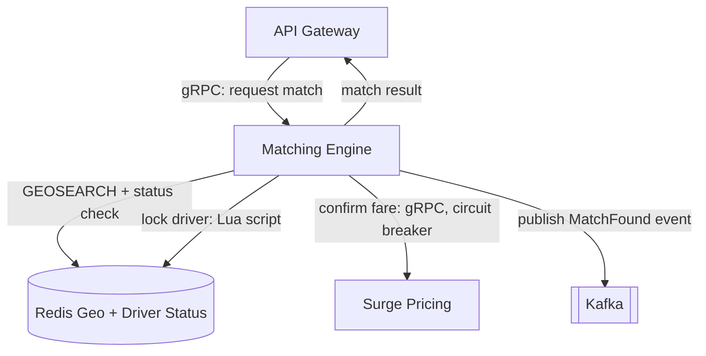

# 04 - Geospatial Matching & Latency

## Geo-Index Choice: Redis Geo vs H3 vs S2

The Matching Engine needs to find nearby drivers fast, at 60 req/s peak, with 150,000 active drivers pinging every 4 seconds (~37,500 pings/s).

| Option | How it works | Verdict |
| :--- | :--- | :--- |
| **Redis Geo** | Sorted set using geohash, `GEOSEARCH` finds drivers within a radius in-memory | **Chosen.** Sub-millisecond radius search, driver locations already live in Redis from ingestion, no extra moving parts |
| Uber H3 | Splits the map into hexagon cells, drivers looked up by cell ID | Great for uneven density (rural vs city), but adds a second index to keep in sync with Redis. Not needed at our scale |
| Google S2 | Splits the map into a hierarchy of cells using space-filling curves | Very precise, but heavier to compute and mainly useful for global-scale spatial joins we don't need here |

**Layout:** one Redis Geo key per city/region (e.g. `drivers:geo:colombo`), so a lookup only ever scans drivers in that region instead of the whole fleet. Each driver's status (`AVAILABLE` / `ASSIGNED`) is stored alongside as a normal Redis key, checked right after the geo lookup.

---

## Latency Budget (must stay under 500ms)

| Step | Where it happens | Budget |
| :--- | :--- | :--- |
| Rider app → API Gateway | Network + TLS | 30 ms |
| API Gateway → Matching Engine | Internal call (gRPC) | 10 ms |
| Find nearby drivers | Redis `GEOSEARCH` | 15 ms |
| Filter & rank candidates | Matching Engine logic | 25 ms |
| Lock the chosen driver | Redis Lua script (atomic flip, see below) | 10 ms |
| Confirm fare | Call to Surge Pricing (gRPC) | 40 ms |
| Publish match event | Kafka producer (async, doesn't block the reply) | 5 ms |
| Response → Rider app | Network | 30 ms |
| **Subtotal** | | **165 ms** |
| Safety margin (queueing, retries, surge slowdown) | | 335 ms |
| **Total** | | **500 ms** |

Keeping the "happy path" around 165ms leaves a big margin for the 5x surge, when queues get longer and downstream calls are slower.

---

## Cache Invalidation on Driver State Change

The Redis Geo index has to always reflect who is actually free, or the engine will keep offering drivers who are already on a ride.

- Every driver state change (`AVAILABLE`, `ASSIGNED`, `OFFLINE`) is written straight to Redis the moment it happens — there is no batch job, so there is no stale window.
- A driver's location and status share the same TTL (~15 seconds). If a driver's phone stops sending pings (crash, tunnel, dead battery), the entry expires on its own and drops out of matching instead of staying "available" forever.
- The atomic lock described below (optimistic locking in Redis) is what stops two riders from being matched to the same driver in the gap between "found" and "assigned."

---

## Protecting the Matching Path: Circuit Breakers & Rate Limiters

During a 5x surge the Matching Engine gets hit hardest, so it needs to fail safely instead of falling over.

- **Rate limiter** on incoming match requests at the API Gateway. Once the Matching Engine is at capacity, extra requests are queued briefly or get a "high demand, please wait" response, instead of overloading Redis.
- **Circuit breaker** on the call to Surge Pricing. If that service starts timing out, the breaker trips and the Matching Engine falls back to the last known price/multiplier instead of blocking every match request on a slow dependency.
- **Bulkheads**: the Matching Engine only talks to Redis and Surge Pricing directly. It never calls Billing or Notifications, so a slowdown in those services can't spread into the matching path.
- If Redis itself is unreachable, the engine returns "no drivers found" rather than hanging — riders can retry, which is better than every request queuing up and breaching the 500ms budget for everyone.

---

## Diagram: C4 Component View — Matching Engine

Source diagram lives in `diagrams/src/`, exported copy in `diagrams/export/`, once the team's diagram tool is agreed at kickoff.

---

## Q&A Prep

1. **What happens if the geo-index cache is stale or gets invalidated at the wrong time?** Location + status share a short TTL, so a stuck driver drops out automatically rather than staying "available" forever; the atomic Redis lock stops two riders grabbing the same driver in the meantime.
2. **How does matching hold up under a sudden 5x spike?** The 165ms happy-path leaves 335ms of margin, plus a rate limiter at the Gateway and a circuit breaker on the Surge Pricing call so one slow dependency can't take down matching.
3. **Why Redis Geo over H3 or S2?** Driver locations already live in Redis from ingestion, and `GEOSEARCH` is sub-millisecond — H3/S2 would add a second index to keep in sync for precision we don't need at this scale.
